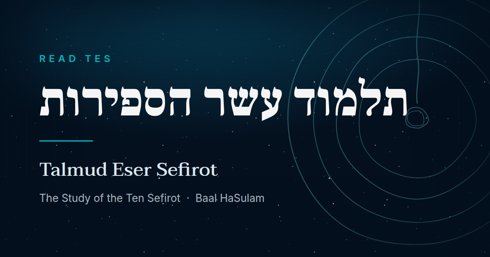

<div align="center">



# Read TES

**Read _Talmud Eser Sefirot_ the way it is studied — the Ari's text, Inner Light, and Inner Observation side by side.**

[](https://nuxt.com)
[](https://vuejs.org)
[](https://www.typescriptlang.org)
[](https://tailwindcss.com)
[](https://vitest.dev)
[](https://pnpm.io)
[](#deployment)

</div>

---

## What this is

_Talmud Eser Sefirot_ ("The Study of the Ten Sefirot") is Baal HaSulam's
systematic exposition of Kabbalah — six volumes, sixteen parts, **5,148
chapters**. It is hard to read linearly, because each passage of the ARI's
source text is meant to be read alongside its commentary.

Read TES presents the work's three-part study structure at once:

| Layer                 | What it is                                                          |
| --------------------- | ------------------------------------------------------------------- |
| **The Ari's text**    | The numbered source passages explained by Baal HaSulam              |
| **Inner Light**       | _Ohr Pnimi_, Baal HaSulam's explanation anchored to the Ari's words |
| **Inner Observation** | _Histaklut Pnimit_, the deeper systematic explanation for the part  |

Anchors between the Ari's text and Inner Light are bidirectional: tap a marker
in either pane and its counterpart scrolls into view. Inner Observation is a
continuous, part-level study text and therefore reads independently.

**Hebrew is first-class, not an afterthought.** RTL layout, Hebrew display and
reading faces with proper glyph subsets, and logical CSS properties throughout —
the interface mirrors rather than breaks.

---

## Quick start

### With Docker

```bash
task dev                 # http://localhost:6217
```

Hot reload against your working tree, with `node_modules` kept container-local.

### Without Docker

```bash
task dev:host            # http://localhost:6217
```

Requires **pnpm 11** and **Node 24+**. Without [go-task](https://taskfile.dev),
use the underlying `pnpm` scripts of the same name.

> **Ports are deliberately odd.** The dev server is **6217** and Vite's HMR
> socket is **6218**, not the Nuxt defaults, so this never collides with another
> local project.

---

## Commands

| Task                   | What it does                                                      |
| ---------------------- | ----------------------------------------------------------------- |
| `task dev`             | Dev server in Docker, hot reload                                  |
| `task check`           | **The full gate** — lint, format, typecheck, content, test, build |
| `task test`            | Vitest suite (47 spec files)                                      |
| `task generate`        | Static site generation — this is the deploy artifact              |
| `task dev:host`        | Dev server on the host, no container                              |
| `task prod`            | Build the SSR bundle + serve with the Nitro Node server (`:6219`) |
| `task docker:prod`     | Build + serve the real static output via nginx (`:6219`)          |
| `task import -- --all` | Re-import the corpus from Sefaria                                 |
| `task clean`           | Remove build artifacts and dependencies                           |

`task --list-all` shows everything.

---

## The corpus

|               |                                      |
| ------------- | ------------------------------------ |
| **Volumes**   | 6                                    |
| **Parts**     | 16                                   |
| **Chapters**  | 5,148                                |
| **Languages** | Hebrew (complete), English (partial) |

### Text versions and licensing

Every passage is attributed. The reader lets you switch between versions and
shows which one you're reading.

| Version                | Lang | Source        | License              |
| ---------------------- | ---- | ------------- | -------------------- |
| `he-jerusalem-1956`    | he   | Sefaria       | Public Domain        |
| `en-sefaria-community` | en   | Sefaria       | CC0                  |
| `en-curated`           | en   | Read TES      | CC-BY                |
| `en-bb`                | en   | KabbalahMedia | Used with permission |
| `en-ai`                | en   | Machine       | CC0                  |

> **`en-ai` is machine-translated and always carries a visible "AI translated"
> badge in the interface.** Where an official Bnei Baruch translation exists it
> is preferred; `en-ai` only fills gaps, and never silently.

---

## Architecture

**Zero runtime APIs.** Every page is prerendered. All content is committed JSON
under `content/`, validated by Zod schemas — the import scripts are build-time
tooling, and the shipped site makes no network calls for text.

**The ToC is split three ways.** `content/toc.json` is 2.9 MB, and loading it in
app code put the entire table of contents into every page's payload — 391 KB
reader pages and hour-scale builds. App code reads `toc.volumes.json` (~17 KB)
and one `toc.parts/part-NN.json` at a time instead. A unit test fails the suite
if anything under `app/` imports the full file again.

```
app/           Components, composables, pages, layouts
content/       Committed JSON corpus + schemas
i18n/locales/  en.json / he.json
scripts/       Import + validation tooling (build-time only)
server/routes/ Prerendered sitemap.xml and robots.txt
shared/        Types and pure helpers used by both app and scripts
tests/unit/    Vitest specs, including architectural guardrails
designs/       Design tokens and the social-card source
```

---

## Testing

```bash
task test
```

47 spec files. Four of them are **guardrails rather than unit tests** — they
enforce the no-full-ToC-import rule, content integrity across the committed
tree, sitemap generation, and the build-manifest prefetch fix. If one fails,
the change is wrong, not the test.

---

## Deployment

`task generate` emits a static site to `.output/public`. Any static host will
serve it.

Set `NUXT_PUBLIC_SITE_URL` at **build** time — it is baked into every canonical
link, hreflang alternate, `og:url`, and the sitemap. There is no runtime config
to correct it afterwards.

```bash
NUXT_PUBLIC_SITE_URL=https://your-domain task generate
```

To run the real production server (SSR via the Nitro Node server, the same
shape weburz uses) — 404 status codes, prerendered sitemap, live rendering:

```bash
task prod                # http://localhost:6219
```

To check the static deploy artifact — 404 status codes, cache headers, the
prerendered sitemap — before shipping:

```bash
task docker:prod         # http://localhost:6219
```

### Cloudflare Pages

| Setting                | Value            |
| ---------------------- | ---------------- |
| Build command          | `pnpm generate`  |
| Build output directory | `.output/public` |
| `NODE_VERSION`         | `24`             |

pnpm 11 is picked up automatically on Cloudflare's v2/v3 build system via
corepack and the `packageManager` field in `package.json` — no separate pnpm
install step needed.

Environment variables (Pages project → Settings → Environment variables):

| Variable                       | Required | Effect                                                                         |
| ------------------------------ | -------- | ------------------------------------------------------------------------------ |
| `NUXT_PUBLIC_SITE_URL`         | Yes      | Baked into every canonical link, hreflang alternate, `og:url`, and the sitemap |
| `NUXT_PUBLIC_UMAMI_SRC`        | No       | Umami script `src` — set together with the website ID to enable analytics      |
| `NUXT_PUBLIC_UMAMI_WEBSITE_ID` | No       | Umami `data-website-id` — leave both unset for no analytics tag                |

`public/_headers` ships with the generated output and gives `/_nuxt/*` and
`/_fonts/*` (content-hashed filenames only) immutable caching automatically —
no Pages-side configuration needed.

---

## Working on this

`CLAUDE.md` and `AGENTS.md` carry the conventions, and `.agents/skills/` holds
task-specific reference that loads on demand. The short version:

- Arrow functions only; composables are `useAdjectiveX`
- Logical CSS properties only — never `ml-`/`mr-`/`left-`/`right-`
- Design tokens only, never a literal hex
- `task check` passes before every commit

---

## License

The code in this repository is licensed under the **MIT License** — see
`LICENSE`. Text content is licensed per version; see the table above. The Bnei
Baruch / KabbalahMedia translations are used with permission and are not
covered by the repository-wide license.
